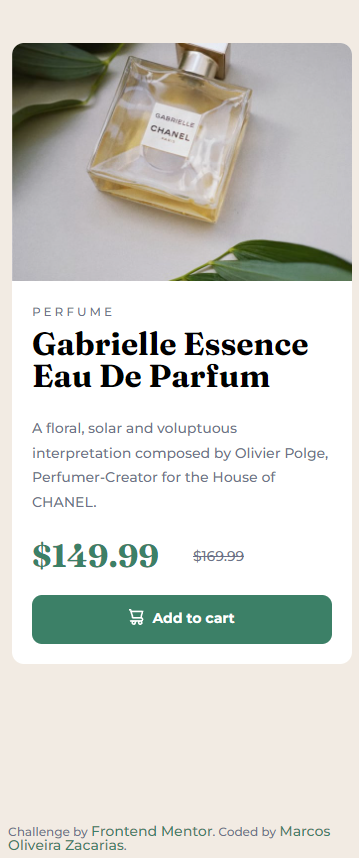
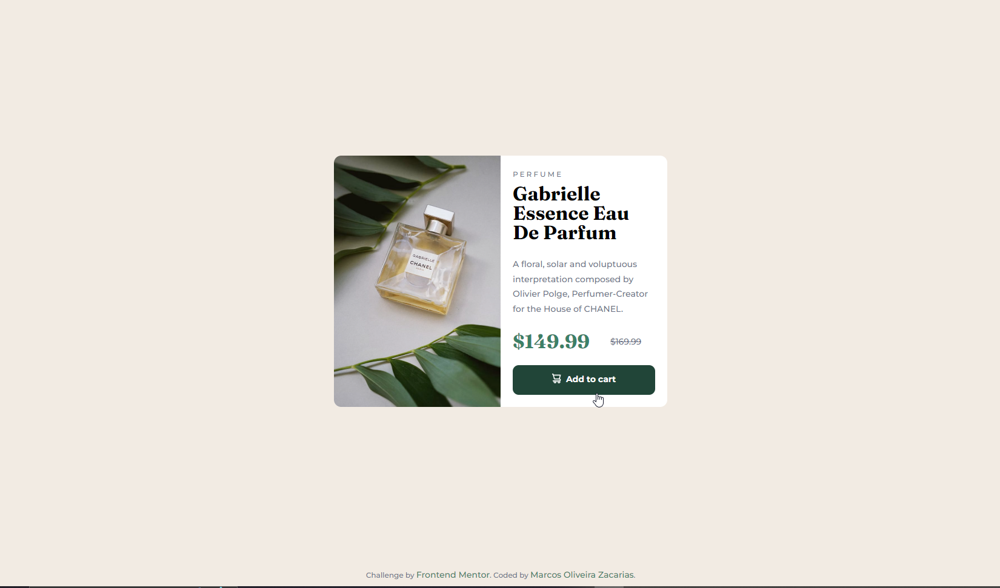

# Frontend Mentor - Product preview card component solution

This is a solution to the [Product preview card component challenge on Frontend Mentor](https://www.frontendmentor.io/challenges/product-preview-card-component-GO7UmttRfa). Frontend Mentor challenges help you improve your coding skills by building realistic projects.

## Table of contents

- [Overview](#overview)
  - [The challenge](#the-challenge)
  - [Time](#time)
  - [Screenshot](#screenshot)
- [My process](#my-process)
  - [Built with](#built-with)
  - [What I learned](#what-i-learned)
  - [Continued development](#continued-development)
  - [Useful resources](#useful-resources)
- [Author](#author)
- [Acknowledgments](#acknowledgments)

**Note: Delete this note and update the table of contents based on what sections you keep.**

## Overview

### The challenge

Users should be able to:

- View the optimal layout depending on their device's screen size
- See hover and focus states for interactive elements

### Time

- Estimated: 7 Hours;
- Spended: 5 Hours;

### Screenshot

**Small Screens:**


**Large Screens:**


## My process

### Built with

- Semantic HTML5 markup
- CSS custom properties
- Flexbox
- CSS Grid
- Mobile-first workflow
- CSS with BEM

### What I learned

- Use BEM;
- Create components;
- Fluid typography;

### Continued development

I had some issues with responsiveness in the project, especially for scaling my blocks, which I endend up using fixed units (px). I believe this could cause future problems.

Css to improve below:

```css
.card {
  width: 340px;
  display: grid;
  border-radius: 0.75rem;
  background-color: var(--neutral-color3);
  margin: 1em;
}

@media (min-width: 1440px) {
  .card {
    width: 550px;
    grid-template-columns: 1fr 1fr;
  }
}
```

### Useful resources

- [Kevin Powell](https://www.youtube.com/kepowob) - Kevin's channel helped me to better plan and structure my project.

- [Modern Fluid Typography Using CSS Clamp](https://www.smashingmagazine.com/2022/01/modern-fluid-typography-css-clamp/) - This article helped me to understand more about fluid and responsiveness typography, even though I haven't used fluid typography.

## Author

- Linkedin - [Marcos Oliveira Zacarias](https://www.linkedin.com/in/marcosoliveirazacarias/)
- Frontend Mentor - [@Moz98](https://www.frontendmentor.io/profile/Moz98)
